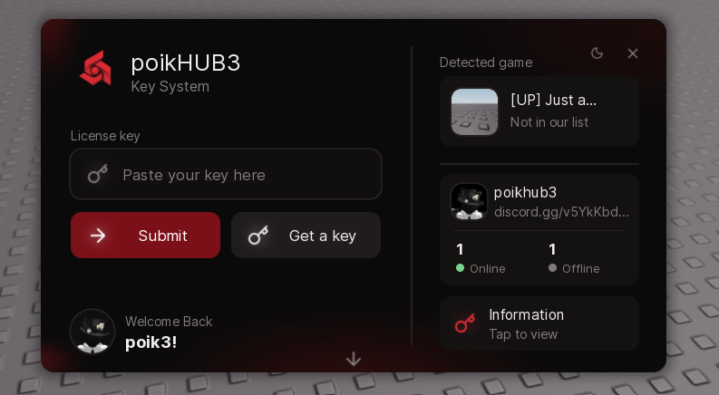
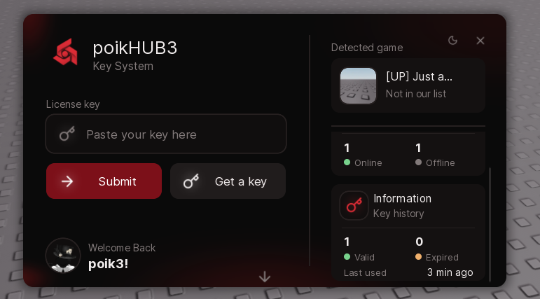
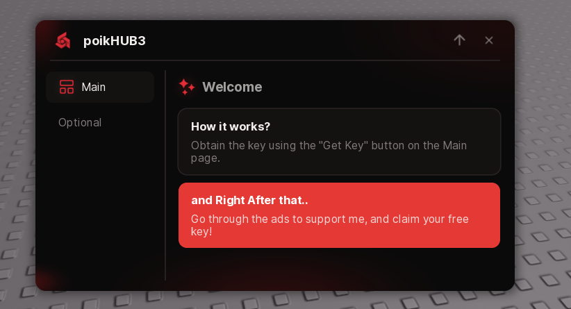
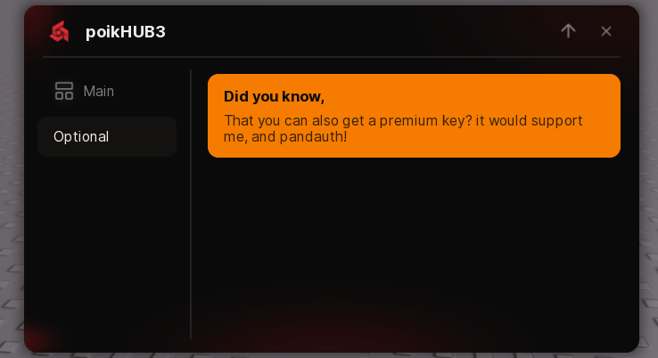

# Ophyn Key System

A polished, key-system UI library for Roblox scripts.  
Supports local keys, **PandaAuth**, **Platoboost**, **Jnkie**, custom validators, keyless mode, themes, notifications, Discord/Website/Info cards, and a secondary tabbed page.





---

## Quick Start

```lua
local KeySystem = loadstring(game:HttpGet("https://raw.githubusercontent.com/poikjgfd3/Ophyn-Space-Fix/refs/heads/main/library.luau"))()

local Window = KeySystem.new({
    Title       = "My Hub",
    Description = "Key System",
    Theme       = "Plant-Dark",
    Folder      = "MyHub-Keys",

    KeySystem = {
        Key     = { "demo-key-1", "demo-key-2" },
        SaveKey = true,
    },

    Callback = function(key)
        print("Authenticated:", key)
        -- your script here
    end,
})
```

---

## Table of Contents

1. [Installation](#installation)
2. [KeySystem.new(options)](#keysystemnewoptions)
3. [Key Validation](#key-validation)
4. [Keyless Mode](#keyless-mode)
5. [Get-Key Methods](#get-key-methods)
6. [Themes](#themes)
7. [Notification Styles](#notification-styles)
8. [Tabs & Page 2](#tabs--page-2)
9. [Sections & Paragraphs](#sections--paragraphs)
10. [Fonts](#fonts)
11. [Cards (Discord / Website / Information)](#cards)
12. [Supported Games](#supported-games)
13. [Window Methods](#window-methods)
14. [Global Helpers](#global-helpers)
15. [Full Example](#full-example)

---

## Installation

Load the single-file bundle however you prefer:

```lua
-- From a URL
local KeySystem = loadstring(game:HttpGet("https://raw.githubusercontent.com/poikjgfd3/Ophyn-Space-Fix/refs/heads/main/library.luau"))()

-- From a ModuleScript
local KeySystem = require(script.Ophyn)
```

The library returns the `KeySystem` table. Call `KeySystem.new(...)` to open the UI.

---

## KeySystem.new(options)

All options are optional. Defaults come from the internal `variables` module.

| Option | Type | Default | Description |
|--------|------|---------|-------------|
| `Title` | string | `"Ophyn"` | Window / hub title |
| `Description` | string | `"Key System"` | Subtitle under the title |
| `Logo` | string / number | built-in asset | Logo image (`rbxassetid://...` or raw id) |
| `Theme` | string | `"Plant-Dark"` | Initial theme name |
| `Folder` | string | `"Ophyn-KSY"` | Folder used for saved keys, stats & Lucide cache |
| `getkey` | boolean | `true` | Show the “Get a key” button |
| `Intro` | boolean / `"true"`/`"false"` | `true` | Play the square intro animation |
| `startintro_size` | number | `80` | Initial size of the intro square |
| `squareintro_time` | number | `1.2` | How long the intro square stays |
| `squarecontorn` | boolean | `true` | Draw an outline around the intro square |
| `Changelogocolor` | boolean | `true` | Tint the logo with the theme accent |
| `Changeiconscolor` | boolean | `true` | Tint icons with theme colors |
| `ChangeTheme` | boolean | `true` | Show the moon button (cycle themes) |
| `discord_link` | string | `""` | Discord invite (code or full URL) |
| `website_link` | string | `""` | Website URL |
| `Discord` | boolean | `true` | Show the Discord card |
| `Website` | boolean | `false` | Show the Website card |
| `Informations` | boolean | `true` | Show the Information (stats) card |
| `NotifStyle` | string | `"1"` | Notification style (`"1"`–`"5"` or name) |
| `TabsStyle` | string | `"1"` | Tabs layout (`"1"` column / `"2"` row) |
| `SupportedGames` | table | `{}` | PlaceIds that count as “Supported” |
| `Keyless` | table / boolean | see below | Keyless mode configuration |
| `KeySystem` | table | `{}` | Key validation config (see next section) |
| `Callback` | function / string | `nil` | Runs after a successful key (or in keyless mode). Can be a function or a string of Lua code. |

### Minimal example

```lua
local Window = KeySystem.new({
    Title = "Cool Hub",
    Callback = function(key)
        print("Key accepted:", key)
    end,
})
```

---

## Key Validation

Pass a `KeySystem` table inside the options:

```lua
KeySystem = {
    Key     = ...,          -- local keys or validator
    URL     = "...",        -- static “Get a key” link (optional)
    SaveKey = true,         -- remember valid keys on disk
    API     = { ... },      -- remote providers
}
```

### 1. Local keys

```lua
Key = { "key-one", "key-two" }
-- or a single string
Key = "super-secret"
```

### 2. Function / callable validator

```lua
Key = function(key)
    if key == "secret" then
        return true
    end
    return false, "wrong key"
end
```

### 3. PandaAuth v4

```lua
API = {
    {
        Type      = "panda",          -- or "pandaauth"
        ServiceId = "YOUR_SERVICE_ID",
        -- Debug  = false,
    },
}
```

### 4. Platoboost

```lua
API = {
    {
        Type      = "platoboost",
        ServiceId = 1234,
        Secret    = "your-secret",    -- required when UseNonce = true (default)
        -- UseNonce = true,
        -- Host     = "https://api.platoboost.app",
    },
}
```

### 5. Jnkie

```lua
API = {
    {
        Type       = "jnkie",
        Service    = "YourServiceName",
        Identifier = "your-user-id",
        Provider   = "Mixed",         -- optional
    },
}
```

You can also use the built-in helper:

```lua
local jnkie = KeySystem.Jnkie.new({
    Service    = "YourServiceName",
    Identifier = "your-user-id",
})

KeySystem = {
    Key = jnkie:Validator(),   -- or just `jnkie` – it auto-wraps
}
```

### 6. Custom service

```lua
API = {
    {
        Type = "custom",
        -- any extra fields you need are passed as `ctx`
        ServiceId = 42,
        Secret    = "abc",

        -- required
        CheckKey = function(key, ctx)
            -- ctx.Request = executor HTTP function (or nil)
            -- ctx also contains every field you put on the entry
            local ok = key == "my-key"
            return ok, ok and nil or "invalid key"
        end,

        -- optional – powers the “Get a key” button
        GetKeyLink = function(ctx)
            return "https://example.com/getkey"
            -- or return nil, "reason"
        end,
    },
}
```

### Combining sources

Local keys are checked first, then every entry in `API` in order.  
The first successful check wins.

```lua
KeySystem = {
    Key = { "dev-key" },
    SaveKey = true,
    API = {
        { Type = "panda", ServiceId = "..." },
        { Type = "platoboost", ServiceId = 1234, Secret = "..." },
    },
}
```

### Saved keys

When `SaveKey = true` the library writes a hashed file under `Folder`.  
On the next launch it auto-fills and validates the saved key.  
Invalid / expired saved keys are automatically deleted.

### Lockout

5 consecutive wrong keys → 30-second lockout on the Submit button.

---

## Keyless Mode

Skip the key check entirely:

```lua
Keyless = {
    enabled        = true,   -- turn keyless on
    disabletextbox = true,   -- dim + lock the key box
    disablegetkey  = true,   -- dim + lock “Get a key”
    showcard       = true,   -- show the “Keyless Mode” card
    autoconfirm    = false,  -- true = run Callback as soon as the UI opens
}

-- shortcuts also work:
Keyless = true
Keyless = false
```

In keyless mode the status becomes **“Keyless”** and Submit (or autoconfirm) calls `Callback("")`.

---

## Get-Key Methods

You can register multiple “Get a key” sources.  
When 2+ methods exist, an arrow appears on the button and opens a dropdown.

```lua
-- Before or after KeySystem.new
KeySystem:GetMethod({
    Title = "Linkvertise",
    Icon  = "link",
    URL   = "https://linkvertise.com/...",
})

KeySystem:GetMethod({
    Title = "LootLabs",
    Icon  = "external-link",
    GetKeyLink = function(ctx)
        -- ctx.Request is the executor HTTP function
        return "https://lootlabs.gg/..."
    end,
})

-- Or on the window instance
Window:GetMethod({ Title = "Work.ink", URL = "https://..." })
```

You can also change the default button text / icon at any time:

```lua
KeySystem:SetGetkeyTitle("Obtain Key")
KeySystem:SetGetkeyIcon("key")          -- Lucide name or asset id

-- same methods exist on the Window object
Window:SetGetkeyTitle("Get Key")
Window:SetGetkeyIcon("rbxassetid://123")
```

---

## Themes

Built-in themes (cycle with the moon button or set via `Theme`):

| Name | Style |
|------|-------|
| `Carmim` | Deep red / black |
| `Plant` | Bright green |
| `Plant-Dark` | Dark green accent (default) |
| `Dark` | Neutral dark |
| `Light` | Light |
| `Violet` | Purple |
| `Midnight` | Deep blue-black |
| `Amber` | Warm orange |
| `Indigo` | Indigo |
| `Amethyst` | Soft purple / pink |

```lua
Theme = "Amethyst"
```

The moon button cycles through all themes with a smooth transition.

---

## Notification Styles

Set globally or per-window:

```lua
NotifStyle = "3"                 -- in KeySystem.new
KeySystem:SetNotifStyle("pill")  -- or "1"–"5" / name
Window:SetNotifStyle("island")
```

| Value | Name | Look |
|-------|------|------|
| `"1"` | Stripe | Color bar + progress line |
| `"2"` | Pill | Compact capsule |
| `"3"` | Island | Top-center dark capsule |
| `"4"` | Ring | Circular timer dots |
| `"5"` | Solid | Filled with status color |

---

## Tabs & Page 2

After the key system you can open a second page that contains tabs, sections and paragraphs.

```lua
local Window = KeySystem.new({ ... })

-- Create a tab (also available as Window:Tab({...}))
local Main = Window({
    Title = "Main",
    Icon  = "house",          -- Lucide name or rbxassetid://...
})

local Settings = Window:Tab({
    Title = "Settings",
    Icon  = "settings",
})

-- Select a tab programmatically
Main:Select()
```

### Tabs layout

```lua
TabsStyle = "1"                 -- left column (default)
TabsStyle = "2"                 -- horizontal row under the topbar

KeySystem:SetTabsStyle("2")
Window:SetTabsStyle("2")
```

A down-arrow appears at the bottom of the key page only after you create at least one tab.

---

## Sections & Paragraphs

### Section

A simple header row (optional icon):

```lua
Main:Section({
    Title = "General",
    Icon  = "sliders",        -- optional
})

-- returns an object with:
--   section:SetTitle("New title")
--   section:Destroy()
```

### Paragraph

A card with title, description, optional color and buttons:

```lua
Main:Paragraph({
    Title = "Welcome",
    Desc  = "This is a description that can span multiple lines.",
    Color = "Green",          -- optional: named color, "#RRGGBB", or Color3
    Buttons = {
        {
            Title    = "Copy Discord",
            Icon     = "message-circle",
            Callback = function()
                setclipboard("https://discord.gg/...")
            end,
        },
        {
            Title    = "Open Site",
            Icon     = "external-link",
            Callback = function()
                -- ...
            end,
        },
    },
})

-- returns:
--   paragraph:SetTitle("...")
--   paragraph:SetDesc("...")
--   paragraph:Destroy()
```

#### Named colors for Paragraph

`red`, `orange`, `yellow`, `green`, `teal`, `cyan`, `blue`, `indigo`, `purple`, `pink`, `grey`/`gray`, `white`, `black`  
(or any `#RRGGBB` / `Color3`)

### Icons (Lucide)

Anywhere an `Icon` is accepted you can pass:

- a Lucide name → `"house"`, `"settings"`, `"sparkles"`, …
- an explicit prefix → `"lucide:house"`
- a Roblox asset → `"rbxassetid://123456"` or a raw number

The Lucide pack is downloaded once and cached on disk under `Folder`.

Browse icons at [lucide.dev/icons](https://lucide.dev/icons).

---

## Fonts

```lua
KeySystem:SetUIFont("Gotham")           -- body text
KeySystem:SetTitleFont("GothamBold")    -- titles

-- also on the Window instance
Window:SetUIFont(Font.fromId(12187365364))
Window:SetTitleFont("BuilderSans")
```

Accepts a font name string, a `Font` object, or an asset id.

---

## Cards

Three optional cards on the right side of the key page:

| Card | Option | Notes |
|------|--------|-------|
| Discord | `Discord = true` + `discord_link` | Expands to show online/offline counts & server icon |
| Website | `Website = true` + `website_link` | Copies the link on click |
| Information | `Informations = true` | Local stats: valid keys, expired keys, last used |
| Keyless Mode | `Keyless.showcard` | Informational only (no click) |

```lua
discord_link = "abc123"                 -- or "discord.gg/abc123" / full URL
website_link = "https://mysite.com"
Discord      = true
Website      = true
Informations = true
```

---

## Supported Games

```lua
SupportedGames = {
    [1234567890] = true,
    9876543210,              -- plain list also works
}
```

The “Detected game” card shows **Supported** (green) or **Not in our list**.

---

## Window Methods

The object returned by `KeySystem.new` supports:

| Method | Description |
|--------|-------------|
| `Window({ Title, Icon })` | Create a tab (callable) |
| `Window:Tab({ Title, Icon })` | Same as above |
| `Window:SetGetkeyTitle(str)` | Change “Get a key” label |
| `Window:SetGetkeyIcon(icon)` | Change “Get a key” icon |
| `Window:SetNotifStyle(style)` | Change notification style |
| `Window:SetTabsStyle("1"\|"2")` | Change tabs layout |
| `Window:GetMethod(entry)` | Register a get-key method |
| `Window:SetUIFont(font)` | Change body font |
| `Window:SetTitleFont(font)` | Change title font |
| `Window.Gui` | The underlying `ScreenGui` |
| `Window:Destroy()` | Close & destroy the UI (forwarded) |
| `Window.Enabled` / `.Parent` / … | Forwarded to the ScreenGui |

---

## Global Helpers

These work **before or after** `KeySystem.new` and affect every window:

```lua
KeySystem:SetGetkeyTitle("Obtain Key")
KeySystem:SetGetkeyIcon("key")
KeySystem:SetNotifStyle("3")
KeySystem:SetTabsStyle("2")
KeySystem:GetMethod({ Title = "...", URL = "..." })
KeySystem:SetUIFont("Gotham")
KeySystem:SetTitleFont("GothamBold")

KeySystem.Jnkie   -- the Jnkie class (see Key Validation)
```

All of the above also accept the colon or dot syntax (`KeySystem:Foo()` / `KeySystem.Foo()`).

---

## Full Example

```lua
local KeySystem = loadstring(game:HttpGet("https://raw.githubusercontent.com/poikjgfd3/Ophyn-Space-Fix/refs/heads/main/library.luau"))()

-- Optional global defaults
KeySystem:SetNotifStyle("pill")
KeySystem:SetTabsStyle("1")
KeySystem:GetMethod({
    Title = "Linkvertise",
    Icon  = "link",
    URL   = "https://linkvertise.com/your-link",
})

local Window = KeySystem.new({
    Title       = "Ophyn Example",
    Description = "Full demo",
    Theme       = "Amethyst",
    Folder      = "OphynDemo",

    getkey      = true,
    Intro       = true,
    ChangeTheme = true,

    discord_link = "discord.gg/example",
    Discord      = true,
    Informations = true,

    NotifStyle = "3",
    TabsStyle  = "1",

    SupportedGames = {
        [2753915549] = true,   -- example PlaceId
    },

    KeySystem = {
        SaveKey = true,
        API = {
            {
                Type      = "panda",
                ServiceId = "YOUR_PANDA_SERVICE_ID",
            },
        },
    },

    Callback = function(key)
        print("[Demo] Key accepted:", key)
        -- loadstring(game:HttpGet("https://.../main.lua"))()
    end,
})

-- Page 2
local Main = Window({ Title = "Main", Icon = "house" })

Main:Section({ Title = "Welcome", Icon = "sparkles" })

Main:Paragraph({
    Title = "Getting started",
    Desc  = "Paste a key obtained from Panda and press Submit (or Enter).",
})

Main:Paragraph({
    Title = "Features",
    Desc  = "Themes, notifications, Discord card, saved keys, lockout, tabs…",
    Color = "Green",
    Buttons = {
        {
            Title    = "Copy Invite",
            Icon     = "message-circle",
            Callback = function()
                setclipboard("https://discord.gg/example")
            end,
        },
    },
})

local Extra = Window({ Title = "Extra", Icon = "puzzle" })

Extra:Section({ Title = "More" })
Extra:Paragraph({
    Title = "Keyless mode",
    Desc  = "Set Keyless = { enabled = true } to skip the key check entirely.",
    Color = "#6366f1",
})
```

---

## Behavior Notes

- The UI mounts to `gethui()` → `CoreGui` → `PlayerGui` (first that works) and replaces any previous window with the same name.
- Enter in the key box submits.
- 5 wrong keys → 30 s lockout.
- Invalid saved keys are deleted automatically.
- Theme / font / gradient bindings are cleaned up when the window is destroyed.
- Lucide icons are cached under `Folder/lucide_pack.lua`.
- All remote libraries (Panda, Platoboost, Jnkie, Lucide) are loaded through a shared HTTP helper with retries.

---

## License / Credits

Ophyn Key System – single-file bundle.  
Lucide icons via [Footagesus/Icons](https://github.com/Footagesus/Icons).  
PandaAuth, Platoboost and Jnkie are third-party key services; you need your own accounts / service IDs. <br>
And for the original owner of the Ophyn.
